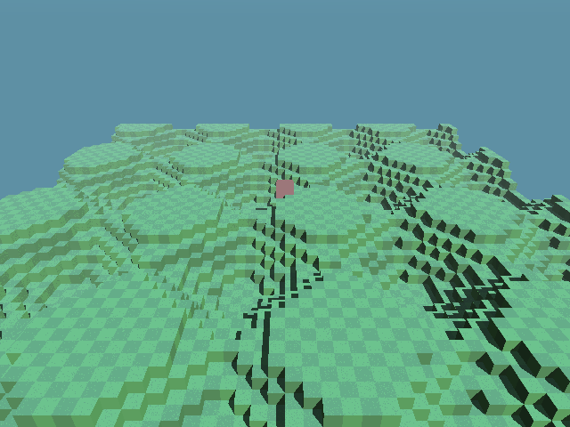
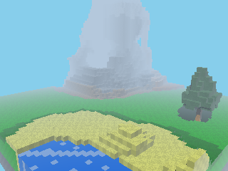
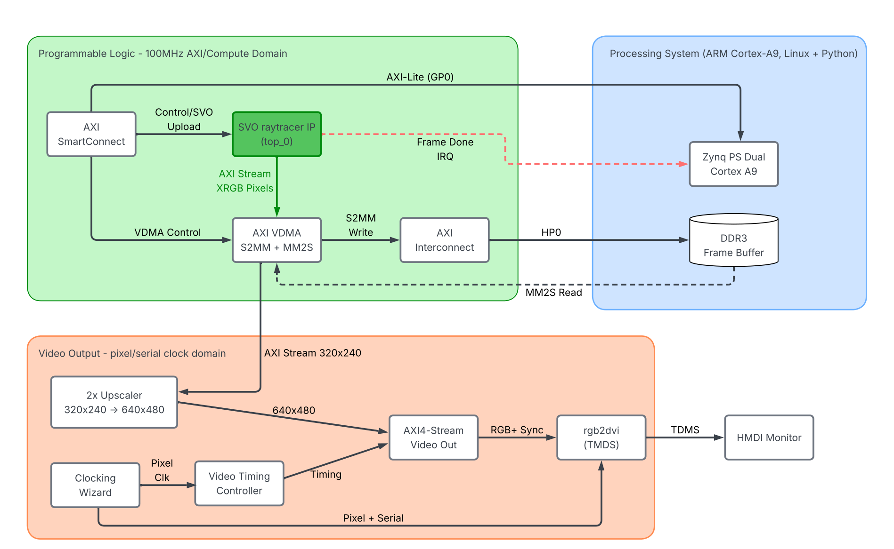
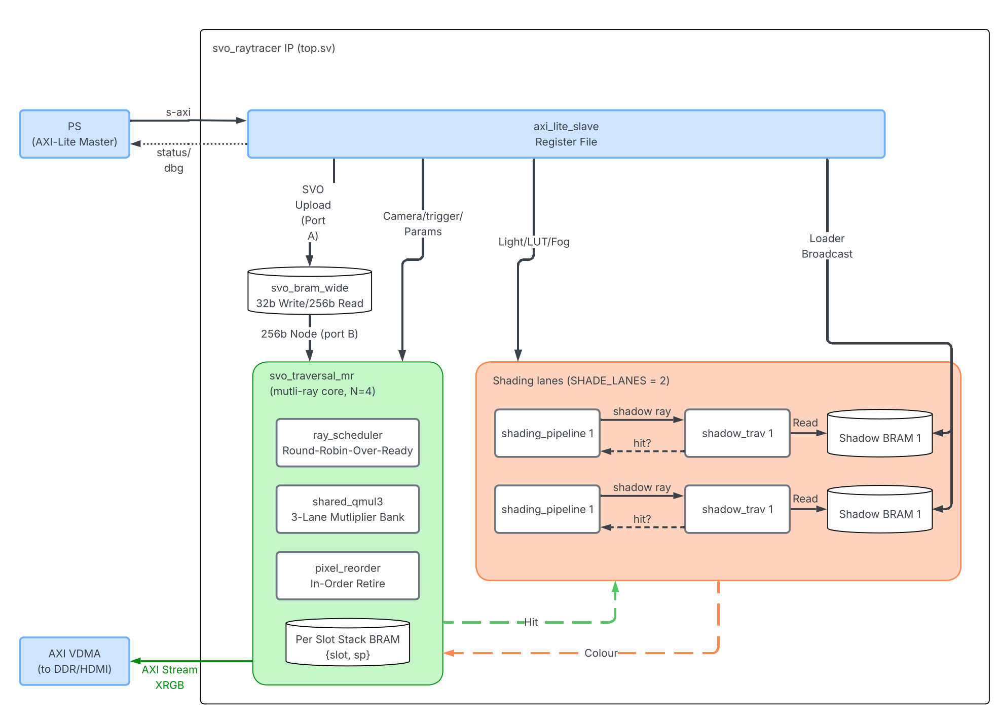

# FPGA Sparse Voxel Octree Ray Tracer

<p align="center">
  
  &nbsp;&nbsp;
  
</p>

An interactive, real-time ray tracer built as a custom SystemVerilog core on a
**PYNQ-Z1** (Xilinx **Zynq-7020**) FPGA. It renders a navigable 64³ voxel world and
lets a viewer change the rendering workload live, flying the camera, toggling shadow
rays, and varying the octree level of detail, while a frame-rate readout shows the
effect on performance. The aim is to make the otherwise invisible trade-offs of
custom hardware visible and explorable. Final-year MEng project.

|  |  |
|--|--|
| **Platform** | PYNQ-Z1, Zynq-7020 (`xc7z020clg400-1`), 100 MHz programmable logic |
| **Resolution** | 320×240 render, upscaled 2× to 640×480 over HDMI |
| **Arithmetic** | signed Q16.16 fixed-point (no floating-point unit, no divider in the inner loop) |
| **Throughput** | 7.3 FPS shaded and shadowed (≈0.93 M rays/s) |
| **Device** | timing closed at 100 MHz (WNS +0.045 ns); 132/220 DSP (60%), 51% BRAM |

## What it does

The programmable logic walks a Sparse Voxel Octree (SVO) with a hierarchical DDA,
one ray per pixel, shades each hit (hemisphere ambient, procedural texture,
Lambertian diffuse, Phong specular, hard shadows, and distance fog), and streams the
pixels through an AXI VDMA into a DDR frame buffer. From there each frame is both
read back by the ARM processor for verification and streamed out live over HDMI. A
pool of four rays is interleaved over a single shared datapath to hide memory and
compute latency.

The ARM processing system builds the octree, uploads it into on-chip BRAM, sets the
camera and rendering registers over AXI-Lite, and drives the interactive
demonstrator.

## Architecture

The system spans the Zynq's two halves: the ARM processing system (PS) orchestrates,
and the FPGA fabric (PL) renders. The processor builds and uploads the octree and
sets the camera and rendering registers; the fabric traverses the octree and streams
pixels through an AXI VDMA into a DDR frame buffer, from which they are both read back
by the processor and driven straight out over HDMI.



The render core itself, the multi-ray SVO traversal datapath, is shown below: the
octree node memory feeds the interleaved traversal engine and the shading and shadow
lanes, whose pixels are reordered into raster sequence for the output stream.



## Repository layout

| Path | Contents |
|------|----------|
| [`vivado/`](vivado/README.md) | SystemVerilog IP, the rebuildable Vivado project, constraints, build script, and post-route reports |
| [`host/`](host/README.md) | PYNQ host code: SVO upload, camera control, the interactive fly-through, the Jupyter notebook |
| [`sim/`](sim/README.md) | cocotb/Verilator verification, the Python golden reference, the FSM cycle profiler |
| [`sw_model/`](sw_model/README.md) | optimised-C software renderer (the CPU performance baseline) |
| `hardware_ref/` | a standalone Python reference renderer and its animated output |
| `python_testing/` | early standalone prototypes (spheres, flat DDA, octree) kept for reference |
| `docs/img/` | architecture and design diagrams used in these guides |

Each main directory has its own README with the detail.

## Quick start

The full flow is **build the bitstream (Vivado) → deploy to the board → run**.

**1. Build the bitstream** (see [`vivado/README.md`](vivado/README.md)). In the
Vivado Tcl console:
```tcl
cd vivado/project_multiray
source create_project.tcl   ;# recreate the project from sources
source commands.tcl         ;# synthesis -> implementation -> bitstream
```

**2. Deploy and run on the board** (see [`host/README.md`](host/README.md)):
```bash
cd host
make upload-multi           # copy bitstream + host code to the PYNQ
```
Then, from a terminal in the board's Jupyter interface (the renderer needs root):
```bash
cd jupyter_notebooks && sudo python3 fly.py
```
Fly with `W/A/S/D` and the arrow keys; `T` toggles shadows; `[` / `]` change the
level of detail; the frame rate is printed live.

**3. Simulate and verify, no board needed** (see [`sim/README.md`](sim/README.md)):
```bash
cd sim
make            # phase 1: geometry-only render in simulation
make shade      # phase 2: full shaded and shadowed render
make compare    # diff the simulated render against the Python golden reference
```

**4. Software baseline** (see [`sw_model/README.md`](sw_model/README.md)):
```bash
cd sw_model
make run                    # render on the desktop CPU
```

## Results

- Timing closed at 100 MHz (worst negative slack +0.045 ns), using 132/220 DSP (60%)
  and 51% of the block RAM.
- 7.3 FPS at 320×240, shaded and shadowed: about 3.8× the frame rate of the board's
  own ARM Cortex-A9, and an order-of-magnitude better in frames per second per watt
  than both the A9 and a desktop CPU (the programmable-logic renderer draws ≈0.5 W).
- Verified pixel-by-pixel against a Python golden reference (98.5% geometry-only
  match, 95.1% fully shaded).
