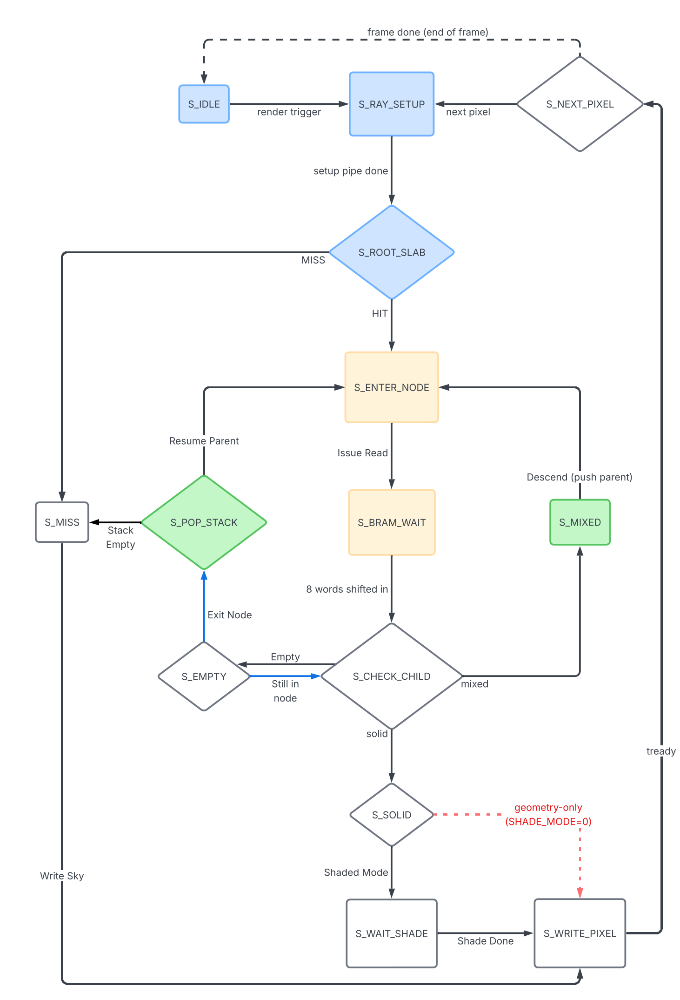
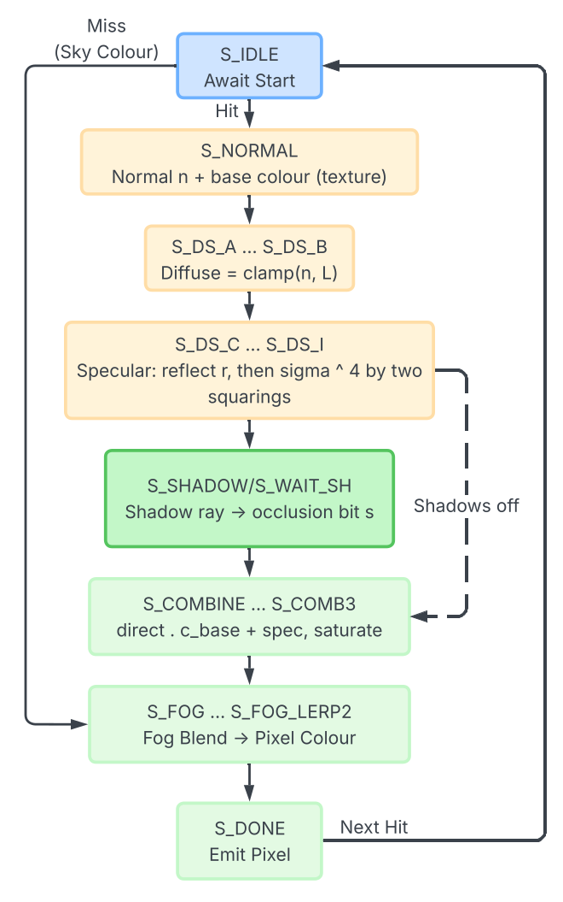

# `vivado/` — hardware (SystemVerilog + Vivado)

The custom ray-tracer IP, the rebuildable Vivado project, the constraints, the build
script, and the post-route implementation reports.

## Layout

| Path | Contents |
|------|----------|
| `ip/svo_raytracer/hdl/` | the render-core RTL (traversal, shading, multiplier bank, node memories, AXI slave) |
| `ip/axis_upscale_2x/` | the 2× HDMI line-upscaler IP |
| `project_multiray/` | a self-contained, rebuildable Vivado project (see its own README) |
| `constraints/` | pin and timing constraints |
| `commands.tcl` | the synthesis → implementation → bitstream build flow |
| `reports/` | post-route timing, utilisation, power and DRC reports, plus a Makefile to refresh them |

## Building the bitstream

Target: PYNQ-Z1, `xc7z020clg400-1`, Vivado 2025.2. In the Vivado Tcl console:

```tcl
cd project_multiray
source create_project.tcl   ;# recreate the project from the committed sources
source commands.tcl         ;# clean synth -> impl (+ phys_opt) -> write_bitstream
```

The bitstream and hand-off file land under `project_multiray/build/`. Deploy them
with `make upload-multi` from `host/`. See `project_multiray/README.md` for the full
rebuild detail, including a manual GUI path if the scripted flow needs adjusting.

## Key RTL modules (`ip/svo_raytracer/hdl/`)

| File | Role |
|------|------|
| `top.sv` | top-level IP: wires the AXI slave, node memories, traversal, shading, shadow lanes, and AXI-Stream output |
| `svo_traversal_mr.sv` | the multi-ray interleaved DDA traversal core (`RAY_POOL_N=4`) |
| `svo_traversal.sv` | single-ray DDA traversal, used for the shadow-ray engines |
| `shading_pipeline.sv` | diffuse + specular + shadow + fog shading |
| `shared_qmul3.sv` | 3-lane fixed-latency Q16.16 multiplier bank (the DSP-sharing unit) |
| `svo_bram_wide.sv`, `svo_bram_shadow.sv` | 256-bit-wide whole-node memory and the geometry-only shadow copy |
| `ray_scheduler.sv`, `pixel_reorder.sv` | round-robin-over-ready scheduler and the in-order pixel reorder buffer |
| `axi_lite_slave.sv` | the AXI4-Lite register file (control, camera, SVO upload, colour LUT) |

Some additional `.sv` files in this folder (`framebuffer.sv`, `hdmi_timing.sv`,
`pixel_upscaler.sv`, `svo_bram.sv`, `stack_store.sv`, `qmul_bank_tagged.sv`) are
earlier or superseded modules kept for reference; they are not part of the shipped
build.

## Design diagrams

The octree traversal finite-state machine (`svo_traversal.sv` / `svo_traversal_mr.sv`):
ray setup, the AABB root test, the per-node BRAM read, child classification, and the
empty/solid/mixed branches that drive the DDA, with an explicit stack for descent and
resumption.



The shading flow applied at each surface hit (`shading_pipeline.sv`): hemisphere
ambient, procedural texture, Lambertian diffuse, Phong specular, the shadow-ray test,
and distance fog, combined into the output pixel.


